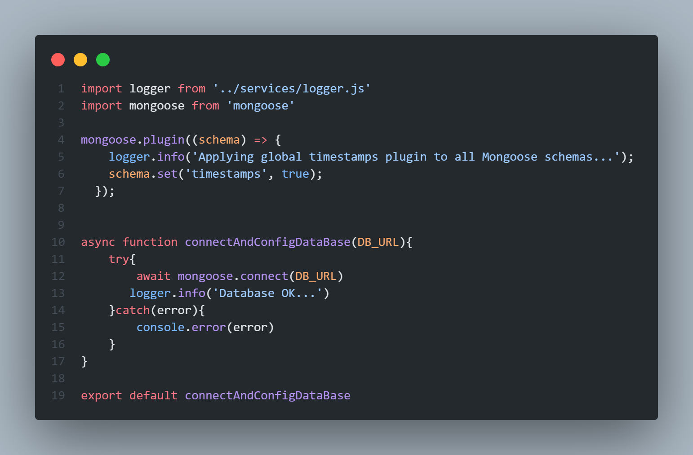
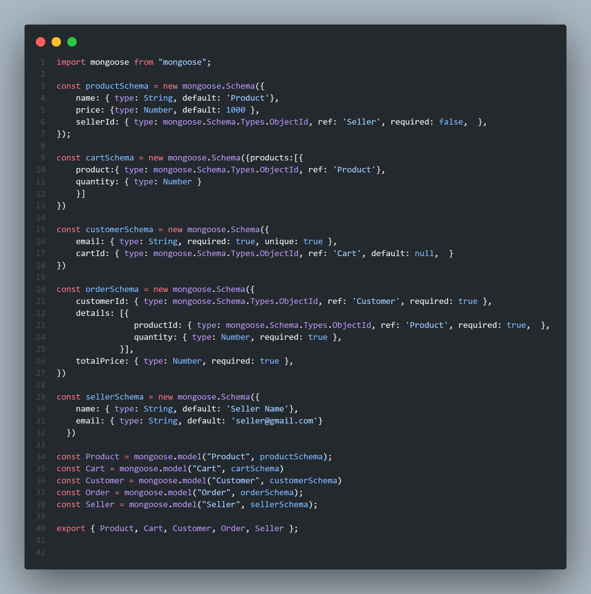
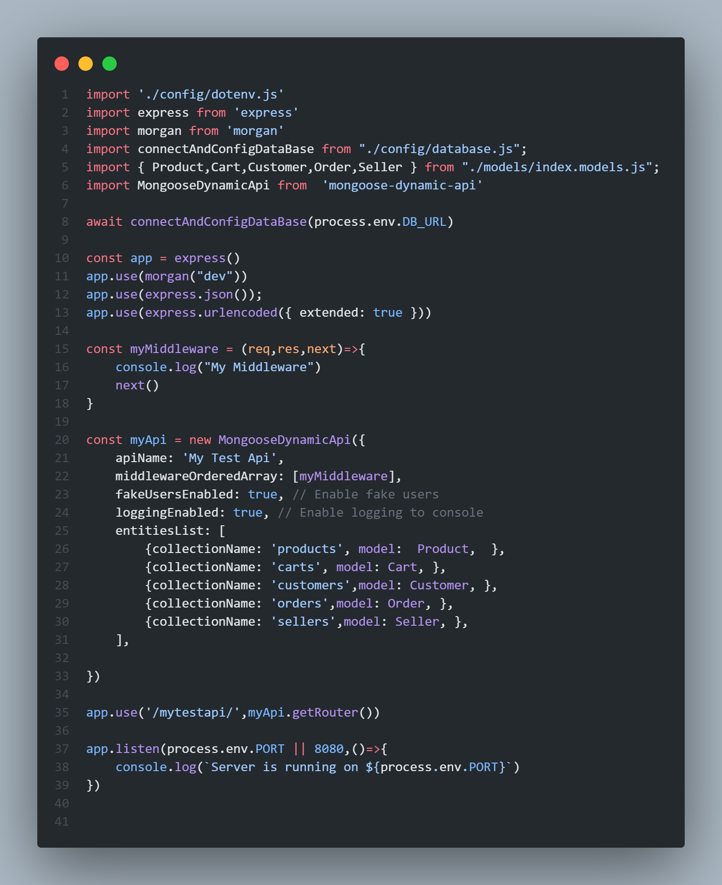
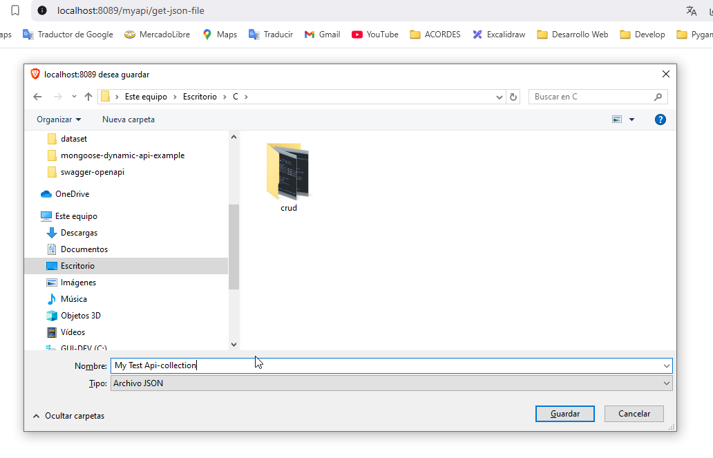
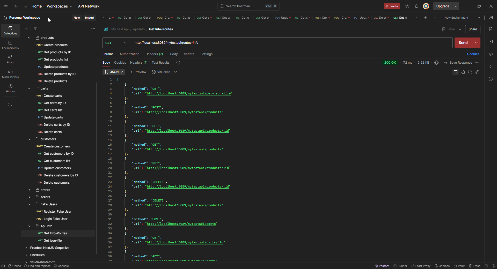
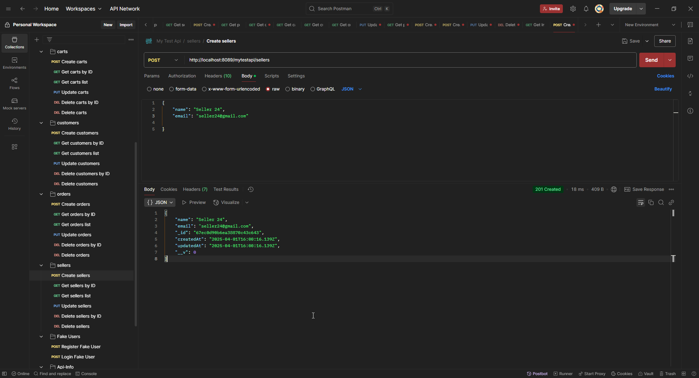
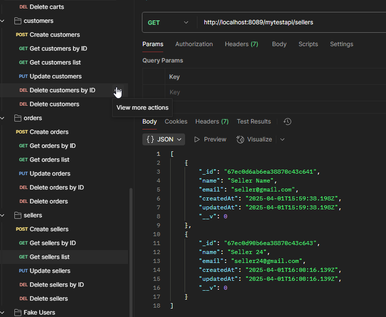
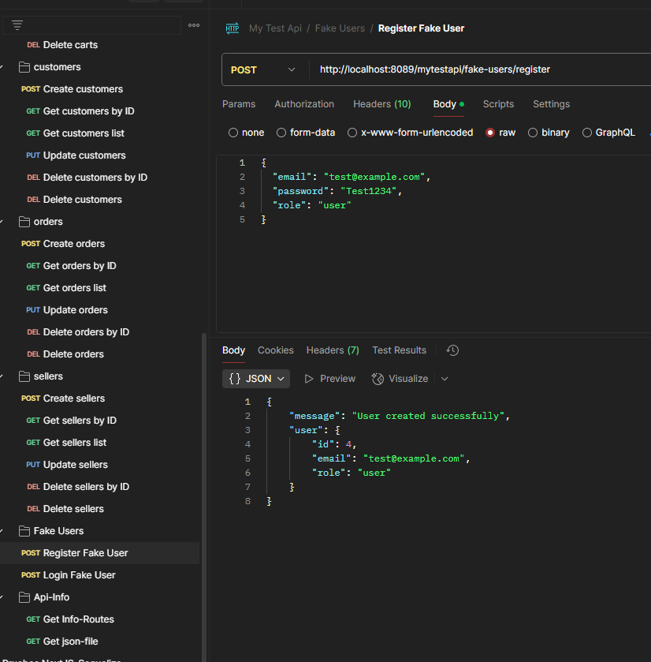
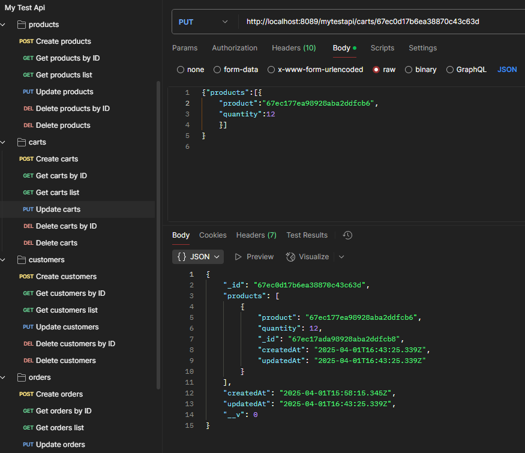
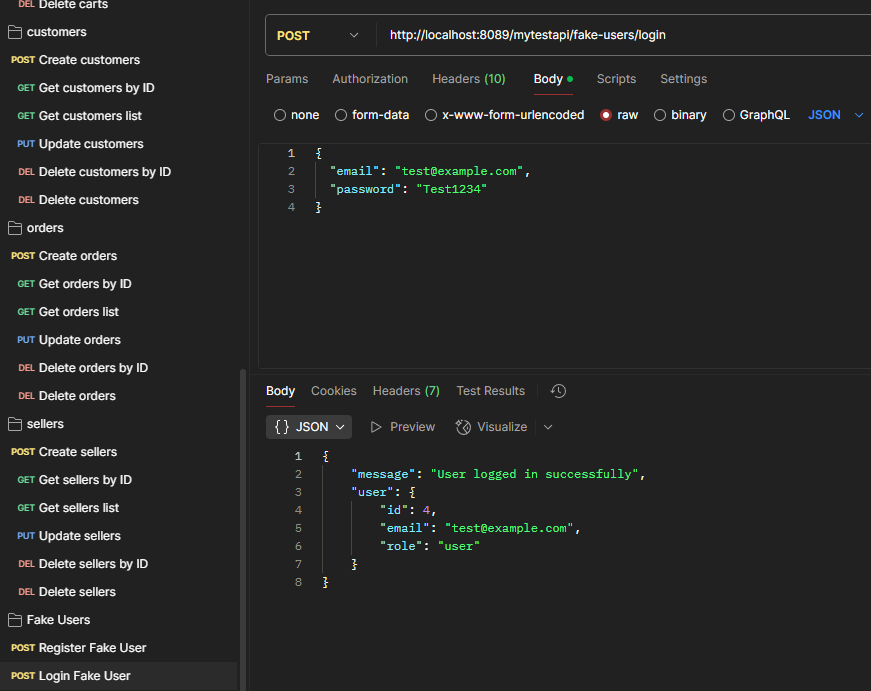

# Mongoose Dynamic API

**ES / EN**

---

## 🇺🇸 What is Mongoose Dynamic API?

How many times have you found yourself designing an Express + Mongoose app, defining your models, and just when you think the hardest part is over… the tedious part kicks in?

Creating routes, writing basic controllers, setting up Postman collections for testing, inserting dummy data… and then you realize you need to add more models or tweak the existing ones.

**Mongoose Dynamic API** helps with that.

Just define your Mongoose models, pass them to `mongoose-dynamic-api`, start your server, and instantly get a **REST API** with full CRUD operations:

- GET ONE  
- GET MANY  
- POST  
- PUT BY ID  
- DELETE BY ID  
- DELETE BY LIST  

Plus, you get a **fake users collection** for quick testing.

You can also inject your own middlewares to customize endpoint logic.  
In short, Mongoose Dynamic API generates a complete router for each model, saving you time and effort. 🎯

---

## 🇪🇸 ¿Qué es Mongoose Dynamic API?

¿Cuántas veces te has encontrado diseñando una aplicación con Express y Mongoose, empezando a definir modelos, y justo cuando creés que lo más difícil ha pasado… llega la parte tediosa?

Crear rutas, escribir controladores básicos, configurar colecciones en Postman para pruebas, insertar datos… y, cuando parece que todo está bajo control, te das cuenta de que necesitás agregar más modelos o modificar algunos.

**Mongoose Dynamic API** puede ayudarte con esto.

Solo definí tus modelos de Mongoose, pasalos a `mongoose-dynamic-api`, poné a correr tu servidor y rápidamente obtenés una **API REST** con un conjunto completo de operaciones CRUD:

- GET ONE  
- GET MANY  
- POST  
- PUT BY ID  
- DELETE BY ID  
- DELETE BY LIST  

Además, incluye una colección de **usuarios ficticios** para hacer pruebas rápidas.

También podés pasarle tus middlewares personalizados para controlar la lógica de tus endpoints.  
En definitiva, Mongoose Dynamic API genera un router completo por cada modelo, ahorrándote tiempo y esfuerzo. 🎯

---

## ✅ Example / Ejemplo

🔗 Full example repo:  
https://github.com/gui24xr/mongoose-dynamic-api-example.git

---

## ✅ Main Features / Características Principales

- ✅ Define your models / Definí tus modelos  
- ✅ Start your server / Corré tu servidor  
- ✅ Get a functional REST API with:
  - Basic CRUD  
  - Your custom middlewares / Tus propios middlewares  
  - Fake users for testing / Usuarios de prueba  
  - Postman-ready JSON / JSON para Postman  

---

## 🎯 Ideal For / Ideal para

- Rapid Prototyping / Prototipos rápidos  
- Small to Medium Applications / Aplicaciones pequeñas y medianas  
- Design & Testing Phases / Fases de diseño y pruebas  

---

## 🚀 Automatic CRUD Operations / Operaciones CRUD Automáticas

- `GET ONE`: Get one record by ID / Obtener un registro por ID  
- `GET MANY`: Get multiple records with filters / Obtener múltiples registros con filtros  
- `POST`: Create a new record / Crear un nuevo registro  
- `PUT`: Update a record by ID / Actualizar un registro por ID  
- `DELETE BY ID`: Delete a record by ID / Eliminar un registro por ID  
- `DELETE BY LIST`: Delete multiple records by ID list / Eliminar múltiples registros por una lista de IDs

---

## 🛠️ Development Tools / Herramientas de Desarrollo

- Auto-generated route list / Listado automático de rutas  
- JSON docs for Postman or Thunder Client / Documentación JSON para Postman o Thunder Client  
- Optional logging system / Sistema de logging opcional  
- Fake users for testing (optional) / Usuarios ficticios para pruebas rápidas

---

## 🎛️ Flexibility / Flexibilidad

- Add your own custom middlewares / Agregá tus propios middlewares  
- Simple configuration / Configuración sencilla  

---

## 👥 Fake Users System / Sistema de Usuarios Fake

- Mock user registration / Registro de usuarios ficticios  
- Quick login for testing / Inicio de sesión rápido  
- Ideal for testing authentication in prototypes / Ideal para validar autenticación en prototipos  
- Easy to enable or disable / Fácil de activar o desactivar  

---

## 🤔 Why Use It? / ¿Por qué usarlo?

- ✅ Fast Development / Desarrollo Rápido  
- ✅ Consistent API structure / Consistencia  
- ✅ Integrated Tools / Herramientas Integradas  
- ✅ Fully Customizable / Adaptable  

---

## 🛠️ Tech Stack / Tecnologías Utilizadas

- Node.js  
- Express  
- Mongoose  
- MongoDB

---

## 📦 Installation / Instalación


---

## 🖼️ Visual Demo / Demo Visual

### 1. 🌐 Database config + plugin setup

<p align="center">
  
</p>

**EN**: Global plugin setup for timestamps + database connection logic  
**ES**: Configuración global del plugin de timestamps + lógica de conexión a la base de datos

---

### 2. 🧱 Mongoose Schemas Definition

<p align="center">
  
</p>

**EN**: Definition of `Product`, `Cart`, `Customer`, `Order`, and `Seller` schemas  
**ES**: Definición de esquemas para `Product`, `Cart`, `Customer`, `Order` y `Seller`

---

### 3. ⚙️ Dynamic API Setup

<p align="center">
  
</p>

**EN**: Express server configuration and API mounting using `mongoose-dynamic-api`  
**ES**: Configuración del servidor Express y montaje de la API usando `mongoose-dynamic-api`

---

### 4. 🧪 Terminal Output

<p align="center">
  
</p>

**EN**: Console logs showing plugin application and API configuration output  
**ES**: Logs de consola que muestran la aplicación del plugin y configuración de la API

---

### 5. 📝 Postman Collection Download

<p align="center">
  
</p>

**EN**: JSON collection auto-generated and ready for Postman  
**ES**: Colección JSON generada automáticamente, lista para Postman

---

### 6. 📂 All Routes in Postman

<p align="center">
  
</p>

**EN**: Full API routes organized by entity inside Postman  
**ES**: Todas las rutas de la API organizadas por entidad en Postman

---

### 7. ✅ Creating a Seller

<p align="center">
  
</p>

**EN**: POST request to create a new seller  
**ES**: Solicitud POST para crear un nuevo seller

---

### 8. 📋 Listing Sellers

<p align="center">
  
</p>

**EN**: GET request returning all sellers  
**ES**: Solicitud GET devolviendo todos los sellers

---

### 9. 👤 Register Fake User

<p align="center">
  
</p>

**EN**: Fake user registration via `/fake-users/register` endpoint  
**ES**: Registro de usuario ficticio vía endpoint `/fake-users/register`

---

### 10. 🛒 Updating a Cart

<p align="center">
  
</p>

**EN**: PUT request to update a cart with product data  
**ES**: Solicitud PUT para actualizar un carrito con productos

---

### 11. 🔐 Login Fake User

<p align="center">
  
</p>

**EN**: Login endpoint to authenticate fake user  
**ES**: Endpoint de login para autenticar un usuario ficticio

---


```bash
npm install mongoose-dynamic-api